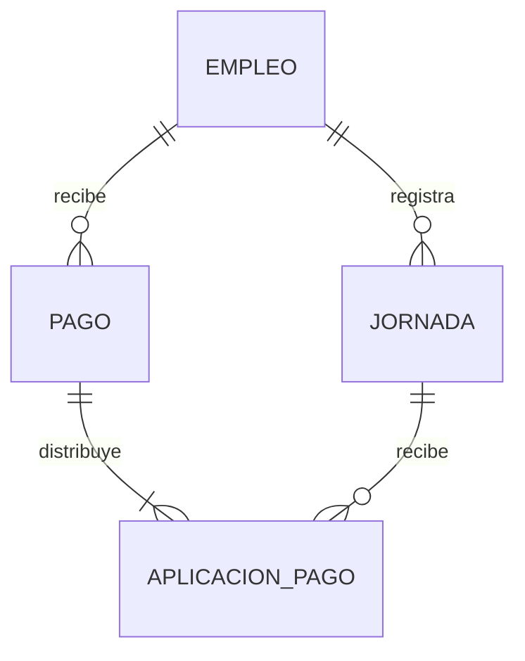
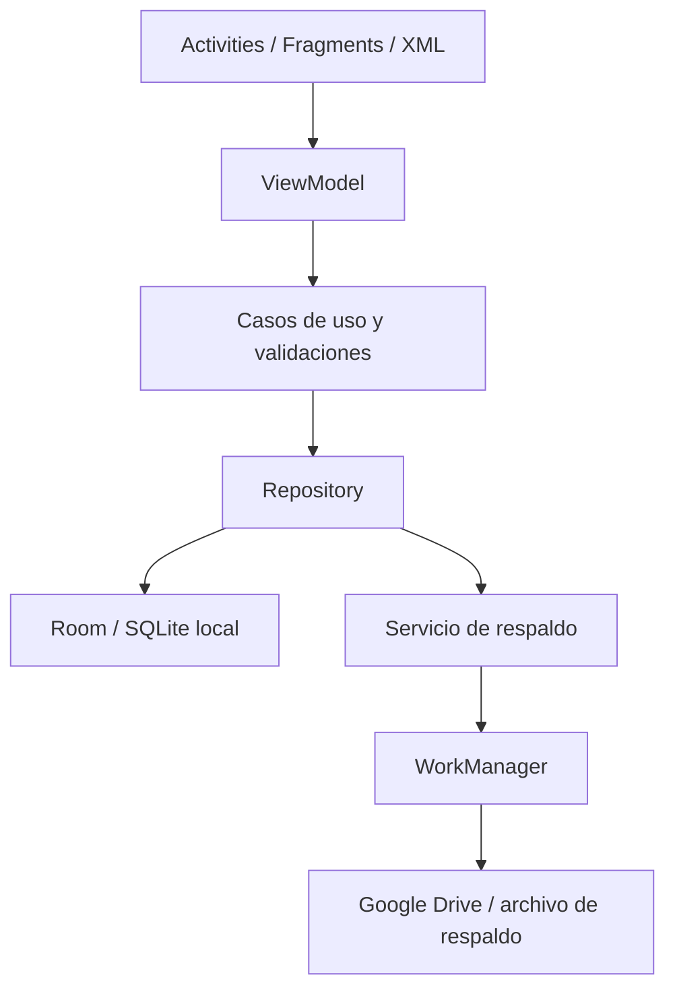

# Mi Control Laboral
## Especificación funcional y técnica inicial — versión 1.0

**Estado:** Documento base para análisis, implementación y validación  
**Plataforma:** Android nativo, Java  
**Usuario inicial:** uso personal  
**Moneda:** bolivianos (BOB / Bs)  
**Zona horaria:** America/La_Paz  
**Persistencia:** Room sobre SQLite (local-first)  
**Respaldo inicial propuesto:** exportación automática/manual a Google Drive mediante archivo de respaldo; sincronización bidireccional queda fuera del MVP hasta definir autenticación y estrategia de conflictos.

---

## 1. Resumen ejecutivo

Mi Control Laboral es una aplicación Android personal para registrar jornadas efectivamente trabajadas en dos empleos separados, calcular ingresos generados, registrar pagos recibidos y mantener un saldo pendiente verificable por empleador y período.

### Empleos iniciales

| Empleo | Días habituales | Jornada completa | Media jornada | Modalidad de pago |
|---|---|---:|---:|---|
| Santillana (almacén de editorial/librería) | Lunes a viernes | Bs 100 | Bs 50 | Puede pagar el mismo día, al día siguiente o al cerrar un período |
| Trabajo en el campo | Sábados | Bs 120 | Bs 60 | Liquidación mensual: paga el mes trabajado durante el mes siguiente |

Las tarifas son valores iniciales configurables, no reglas rígidas. Cada jornada debe guardar el importe aplicado al momento del registro para que cambios futuros no alteren el historial.

**No se deben promediar los pagos.** Se registrará la modalidad real de cada jornada: completa, media jornada o importe personalizado. Para los importes conocidos, media jornada equivale a la mitad de la tarifa configurada.

## 2. Objetivos

1. Registrar una jornada en pocos pasos.
2. Separar Santillana del trabajo de los sábados.
3. Evitar olvidar jornadas o duplicar registros.
4. Diferenciar ingreso generado, monto cobrado y saldo pendiente.
5. Permitir pagos que cubran una o varias jornadas, incluidos pagos parciales.
6. Consultar períodos laborales, semanas, meses y rangos personalizados.
7. Mantener datos disponibles sin Internet.
8. Facilitar copias de seguridad y recuperación.

## 3. Alcance del MVP

### Incluido
- Alta, edición y archivo de empleos.
- Configuración de tarifa completa y cálculo de media jornada.
- Registro de jornada completa, media jornada o monto personalizado.
- Calendario e historial por empleo.
- Prevención de duplicados por empleo y fecha.
- Registro de pagos asociados a uno o varios días, con asignación explícita.
- Resumen generado/cobrado/pendiente.
- Informes semanales, mensuales y por rango.
- Exportación y restauración de respaldo.
- Funcionamiento offline.

### Fuera del MVP
- Nómina para terceros, facturación, asistencia GPS, cuentas multiusuario, publicación en tiendas, sincronización colaborativa y reportes fiscales.
- Sincronización cloud automática bidireccional hasta probar un mecanismo fiable de identidad, conflictos y restauración.

## 4. Reglas de negocio

### RB-01 — Calendarios laborales separados
- Santillana: días habituales de lunes a viernes.
- Campo: sábado.
- La app puede mostrar un calendario mensual común, pero los informes y filtros deben separar los empleos.
- No se debe sumar automáticamente una jornada por ser día habitual: el usuario confirma que efectivamente trabajó.

### RB-02 — Tipos de jornada
Cada jornada tendrá tipo:
- `COMPLETA`: 100% de la tarifa completa.
- `MEDIA`: 50% de la tarifa completa.
- `PERSONALIZADA`: importe ingresado por el usuario.

Importes iniciales:
- Santillana: completa Bs 100; media Bs 50.
- Campo: completa Bs 120; media Bs 60.

Al cambiar tarifas, las jornadas históricas conservan el importe ya guardado.

### RB-03 — Días separados
Los dos empleos son independientes. En el MVP se permite como máximo una jornada por empleo y fecha. Si se registra una segunda, se muestra la existente y se permite editarla, no duplicarla. La restricción única será `(empleo_id, fecha_local)`.

### RB-04 — Pagos de Santillana
Un pago puede recibirse el mismo día, al siguiente o en otra fecha. No se presupone que el pago sea diario. Se registra la fecha real de recepción y qué jornadas cubre. Puede cubrir una o varias jornadas.

### RB-05 — Pago del trabajo en el campo
El ciclo esperado es mensual: las jornadas de un mes se agrupan en una liquidación del período; el pago suele recibirse durante el mes siguiente. La app debe mostrar el mes trabajado, total devengado, total abonado y saldo, sin marcarlo como pagado hasta registrar el cobro real. La fecha de pago real es independiente del mes de trabajo.

### RB-06 — Pagos parciales y asignación
Un pago puede cubrir varias jornadas; una jornada puede recibir varios abonos. No permitir que la suma asignada a una jornada exceda su importe generado. Si se registra un pago global, solicitar asignación a jornadas o permitir una distribución explícita y visible.

### RB-07 — Métricas
- Generado del período: suma de importes de jornadas cuya fecha trabajada cae dentro del período.
- Cobrado del período de trabajo: suma de abonos asignados a esas jornadas, incluso si se recibieron en otro mes.
- Efectivo recibido en fechas: suma de pagos cuya fecha de recepción cae en el rango seleccionado.
- Pendiente: generado menos cobros asignados, nunca menor que cero.
La interfaz debe distinguir claramente “cobrado por jornadas del período” de “dinero recibido durante el período” para evitar confusión.

### RB-08 — Semana
No forzar una sola semana operativa para ambos empleos. El informe semanal estándar será lunes a domingo, con filtros por empleo. La vista de Santillana resaltará lunes-viernes; la del campo resaltará sábados. También se puede mostrar una agrupación laboral lunes-sábado, pero sin cambiar las fechas reales ni mezclar los subtotales por empleo.

### RB-09 — Mes y rango personalizado
Mes calendario del día 1 al último día, zona horaria `America/La_Paz`. Rango personalizado inclusivo: desde y hasta. Las fechas se almacenan como fecha local ISO (`YYYY-MM-DD`) para jornadas; timestamps de cobros se almacenan con instante y zona/fecha local pertinente.

### RB-10 — Correcciones y borrado
Ediciones y borrados deben actualizar resúmenes y marcar cambios para respaldo. Si una jornada tiene cobros, no permitir borrado silencioso: solicitar revertir/reasignar cobros o anular mediante operación auditada.

## 5. Requisitos funcionales

| ID | Requisito |
|---|---|
| RF-01 | Crear y editar empleo, tarifa completa, estado y días habituales. |
| RF-02 | Precargar Santillana (100/50; lunes-viernes) y Campo (120/60; sábado), permitiendo editar. |
| RF-03 | Registrar jornada completa, media o personalizada con fecha. |
| RF-04 | Mostrar importe calculado antes de confirmar. |
| RF-05 | Evitar duplicado por empleo y fecha. |
| RF-06 | Consultar, filtrar y corregir jornadas. |
| RF-07 | Registrar cobro con fecha real, monto y nota opcional. |
| RF-08 | Asignar un cobro a una o varias jornadas; admitir abonos parciales. |
| RF-09 | Calcular generado, cobrado asignado y pendiente. |
| RF-10 | Mostrar informe semanal (lunes-domingo), mensual y rango personalizado. |
| RF-11 | Separar subtotales por empleo y mostrar total combinado. |
| RF-12 | Mostrar liquidación mensual del Campo y estado de pago del mes siguiente. |
| RF-13 | Exportar respaldo y restaurar con confirmación. |
| RF-14 | Indicar estado de copia de seguridad y fecha de última copia. |
| RF-15 | Funcionar y permitir registro sin Internet. |

## 6. Requisitos no funcionales

- Android nativo, Java; interfaz XML y componentes Android compatibles.
- Arquitectura MVVM, Repository y capa de dominio.
- Room/SQLite como fuente local principal.
- Operaciones de base de datos fuera del hilo UI.
- Montos almacenados como enteros en centavos (por ejemplo Bs 100 = 10000); mostrar Bs con dos decimales cuando corresponda.
- UUID para identificadores estables.
- Validación de importes positivos, fechas y asignaciones.
- Privacidad: acceso restringido al usuario; no incluir secretos/API keys privadas en el cliente.
- La app debe ser útil sin permisos de ubicación ni conexión.
- Pruebas unitarias para cálculos, límites de períodos y asignaciones.
- Compatibilidad mínima de Android se fijará al crear el proyecto según dispositivo y dependencias vigentes.

## 7. Modelo de datos propuesto

### EMPLEO
- `id` TEXT/UUID PK
- `nombre` TEXT
- `tarifa_completa_centavos` INTEGER
- `dias_habituales` TEXT/JSON o tabla hija si se requiere consulta avanzada
- `activo` INTEGER
- `created_at`, `updated_at`

### JORNADA
- `id` TEXT/UUID PK
- `empleo_id` FK
- `fecha_local` TEXT (`YYYY-MM-DD`)
- `tipo_jornada` TEXT (`COMPLETA`, `MEDIA`, `PERSONALIZADA`)
- `monto_centavos` INTEGER
- `nota` TEXT nullable
- `created_at`, `updated_at`
- UNIQUE(`empleo_id`, `fecha_local`)

### PAGO
- `id` TEXT/UUID PK
- `fecha_recibido` TEXT/ISO timestamp
- `monto_total_centavos` INTEGER
- `origen_empleo_id` FK nullable (para facilitar filtros; un pago debe pertenecer a un empleo en el MVP)
- `nota` TEXT nullable
- `created_at`, `updated_at`

### APLICACION_PAGO
Tabla puente que distribuye el pago entre jornadas:
- `id` UUID PK
- `pago_id` FK
- `jornada_id` FK
- `monto_aplicado_centavos` INTEGER
- UNIQUE(`pago_id`, `jornada_id`)

### CONTROL_RESPALDO
- `registro_id`, `tipo_entidad`, `estado`, `updated_at`, `deleted_at` nullable, `last_error` nullable.

**Nota de diseño:** el pago del Campo de fin de mes se modela como uno o varios pagos reales aplicados a las jornadas del mes trabajado. Una futura entidad `LIQUIDACION` puede agrupar explícitamente el período, pero no es imprescindible para el primer MVP.

### Relaciones

## 8. Arquitectura

### Recomendación de respaldo inicial
Para evitar complejidad y costos inesperados, iniciar con **respaldo versionado a archivo** y flujo de guardar/restaurar en Google Drive. La integración directa con Drive requiere OAuth y permisos; no asumir que cualquier carpeta puede escribirse sin configuración. Primero implementar exportación/importación local validada; luego integrar Drive mediante selector de archivos o API autorizada. No borrar datos locales al fallar una copia.

Firebase no es obligatorio para el MVP. Puede evaluarse más adelante si se necesita sincronización continua entre dispositivos. “Gratis” depende de cuotas, configuración y uso; revisar precios y límites vigentes antes de activarlo.

## 9. Pantallas

1. Inicio: total generado, cobrado por jornadas, pendiente y accesos.
2. Trabajos: Santillana y Campo, tarifas, días habituales.
3. Registrar jornada: empleo, fecha, completa/media/personalizada, monto calculado, nota.
4. Calendario/historial: filtros por empleo y período.
5. Registrar cobro: fecha recibida, importe y asignación a jornadas.
6. Informes: semana, mes, rango personalizado, subtotales por empleo.
7. Respaldo: exportar, importar, última copia y estado.

## 10. Casos de aceptación

| Caso | Entrada | Resultado esperado |
|---|---|---|
| Santillana completa | 1 jornada completa | Bs 100 generado |
| Santillana media | 1 media jornada | Bs 50 generado |
| Campo completo | 1 sábado completo | Bs 120 generado |
| Campo media | 1 sábado medio | Bs 60 generado |
| Cambio de tarifa | Tarifa nueva Bs 110 | Jornadas antiguas mantienen su monto |
| Cobro parcial | Jornada Bs 100; abono Bs 50 | Pendiente Bs 50 |
| Pago agrupado | Cobro Bs 220 asignado a dos jornadas | Ambas quedan saldadas según distribución |
| Pago diferido | Trabajo en octubre cobrado en noviembre | Ingreso devengado en octubre; efectivo recibido en noviembre |
| Sin conexión | Registrar jornada offline | Se guarda localmente |
| Duplicado | Mismo empleo y fecha | Se bloquea o se ofrece editar existente |

## 11. Plan de implementación

### Iteración 0 — Preparación
- Confirmar nombre, reglas y Android mínimo.
- Crear repositorio Git.
- Crear proyecto Android Java.
- Definir estructura y convenciones.

### Iteración 1 — Núcleo local
- Entidades Room y DAOs.
- Precarga de Santillana y Campo.
- CRUD de empleos.
- Registro y edición de jornadas.
- Validación de duplicados.

### Iteración 2 — Resúmenes
- Cálculos monetarios.
- Agrupación por empleo, semana y mes.
- Selector de rango personalizado.
- Pruebas de fechas y totales.

### Iteración 3 — Cobros
- Pagos recibidos.
- Asignación a jornadas.
- Abonos parciales.
- Saldos y pagos diferidos.

### Iteración 4 — Respaldo
- Exportación versionada.
- Validación antes de restaurar.
- Copia a Google Drive mediante flujo autorizado.
- Pruebas de recuperación.

### Iteración 5 — Pulido y entrega
- UI y accesibilidad.
- Pruebas en dispositivo real.
- Manejo de errores.
- APK de prueba y guía de usuario.

## 12. Recomendaciones para el agente de programación

- Leer este documento completo antes de modificar archivos.
- No cambiar Java por Kotlin.
- No reemplazar Room por almacenamiento temporal.
- No implementar funciones fuera del alcance sin solicitar aprobación.
- Mantener importes en centavos enteros.
- No asumir que el día habitual fue trabajado.
- No marcar pagos como recibidos automáticamente.
- No mezclar mes trabajado con mes de recepción del dinero.
- Crear pruebas para las reglas de negocio.
- Entregar instrucciones de compilación y ejecución en Android Studio.
- Trabajar por iteraciones pequeñas, compilar y probar después de cada una.
- Antes de integrar Google Drive, presentar el mecanismo de autenticación, permisos y recuperación propuesto.

## 13. Decisiones pendientes para aprobación

1. Confirmar que el resumen semanal estándar será lunes-domingo, con Santillana filtrada lunes-viernes y Campo los sábados.
2. Confirmar que cada empleo permite una jornada por fecha.
3. Confirmar que el pago del Campo se registra como pago real al mes siguiente, asignado al mes trabajado.
4. Elegir si la primera integración con Drive será manual mediante selector de archivos o automática mediante autenticación y API.

**Fin de especificación inicial.**
